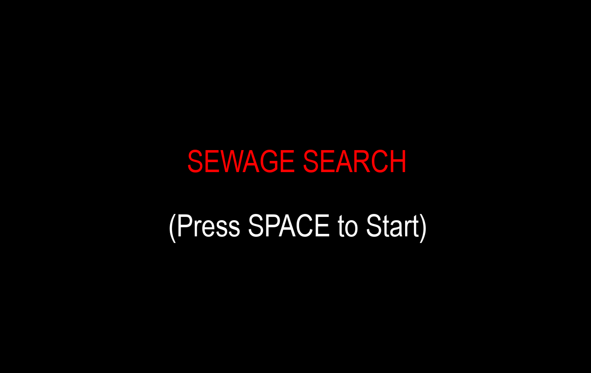
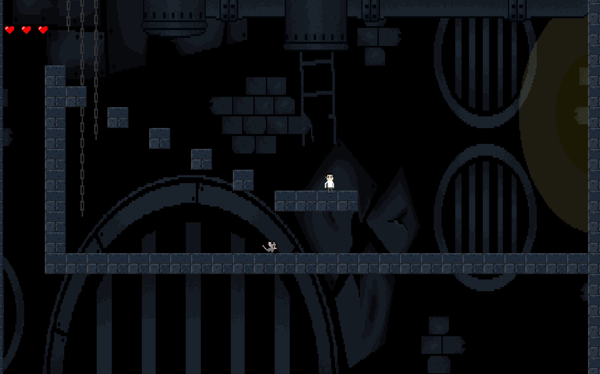

# 🐀 Sewerage Search: Descend Into Madness  

A 2D vertical platformer made for the **SFU Mountain Madness 2025**.  
Descend deeper into the sewers to find the cat where rats get bigger, the art gets stranger,  
and the game drives the player into madness.
---

## 🎮 Gameplay  

- **Movement** → Run and jump across platforms with gravity mechanics.  
- **Enemies** → Rats patrol back and forth.  
- **Health System** → Start with 3 hearts; collisions reduce health.  
- **Scrolling** → The screen scrolls downward as the player descends.  
- **No True Ending** → Finding the cat still kills you, reinforcing the theme of madness.  

---

## ✨ Inspiration  

Inspired by **Louis Wain**, the English artist famous for cat illustrations.  

- His work became more abstract and chaotic as he developed schizophrenia.  
- We mirrored this by making imagery stranger and rats bigger as the game progresses.  
- The goal: capture a **descent into chaos and frustration** through gameplay and visuals.  

---

## 🕹️ Controls  

- **Arrow Keys / WASD** → Move & Jump  
---

## 🛠️ Tech & Team  

- Built with **Python + Pygame**  
- Created in **24 hours** for the **SFU Hackathon**  

---

## 📸 Screenshots

---

## 🚧 Future Ideas  

- Power-ups and new enemy types  
- Procedurally generated sewer levels  
- Increasingly abstract art progression tied to descent  

Links:
## https://png.pngtree.com/element_our/20190603/ourmid/pngtree-men-s-pixel-villain-illustration-image_1433976.jpg
## https://dinopixel.com/preload/1122/cat-gif-DD.png 
## https://static.vecteezy.com/system/resources/thumbnails/009/877/890/small_2x/pixel-art-minimalist-city-background-for-8bit-game-vector.jpg

